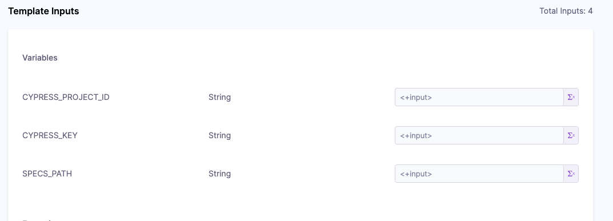

# Cypress tests for harness-core-ui

## Running tests locally

For running cypress locally, multiple terminal instances are required.

1. Under `cypress` directory, run `yarn install` to install dependencies. You can skip this step if you have already installed the dependencies.
2. In a seperate terminal, run `yarn dev:cypress` under root of the project, to start webpack build.
3. In a seperate terminal, under `cypress` directory, run `yarn server`, to start a proxy server.
4. In a seperate terminal, under `cypress` directory, run `yarn cypress:open`

Note: Make sure that you have update the ENV variables in you `.env` file as shown below.

```
BASE_URL=http://localhost:8080
TARGET_LOCALHOST=false
```

## Running tests on CI

CI Pipelines make use of the [this template](https://app.harness.io/ng/#/account/vpCkHKsDSxK9_KYfjCTMKA/ci/orgs/default/projects/NextGenUI/setup/resources/template-studio/Stage/template/Cypress_Split/?versionLabel=v1)

For creating a new pipeline, just use the stage template in a pipeline and update the following parameters:



`CYPRESS_PROJECT_ID`: The project key from cypress project

`CYPRESS_KEY`: The cypress record from cypress project settings

`SPECS_PATH`: The glob of paths for which tests need to be run.
